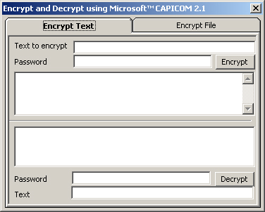



## Encrypt/Decrypt using CAPICOM \(NEW\)

### Description

Encrypts and Decrypts Texts and Files with Capicom 2.1.

Now i've added on the fly an app sample (xml involved). If u like it plz vote !
 
### More Info
 

             |
---                |---
**Submitted On**   |2005-06-16 17:33:32
**By**             |[Fabio La Vitola](https://github.com/Planet-Source-Code/PSCIndex/blob/master/ByAuthor/fabio-la-vitola.md)
**Level**          |Intermediate
**User Rating**    |5.0 (10 globes from 2 users)
**Compatibility**  |VB 5\.0, VB 6\.0
**Category**       |[Encryption](https://github.com/Planet-Source-Code/PSCIndex/blob/master/ByCategory/encryption__1-48.md)
**World**          |[Visual Basic](https://github.com/Planet-Source-Code/PSCIndex/blob/master/ByWorld/visual-basic.md)
**Archive File**   |[Encrypt\_De1903776202005\.zip](https://github.com/Planet-Source-Code/fabio-la-vitola-encrypt-decrypt-using-capicom-new__1-61253/archive/master.zip)

